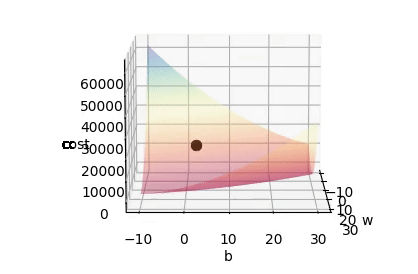
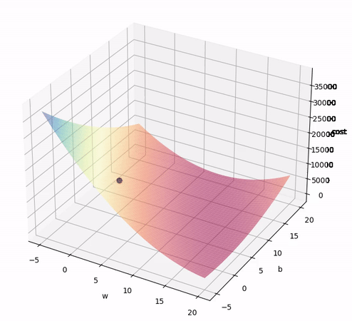
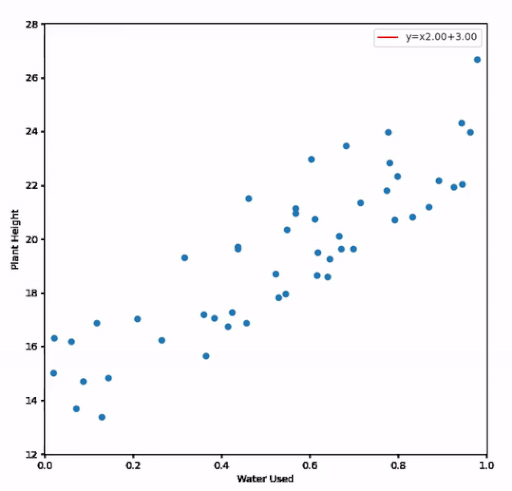

# ML-For-Dumbies

This repository constains all the code used in the article ["Machine learning for dummies: An Introduction"](https://medium.com/@miguelpeixoto457/4349ac29f483?source=friends_link&sk=13115a012a4dadc3144a31ba59c18b8d)

The article explores the basic concepts behind ML with a simple example using linear regression. It also explores some of the terminology and metrics.

